# itscm-skills

**Terms used here.** The full list is [`GLOSSARY.md`](GLOSSARY.md).

| | |
|---|---|
| **MTD** | Maximum Tolerable Downtime |
| **RTO** | Recovery Time Objective |
| **RPO** | Recovery Point Objective |
| **BIA** | Business Impact Analysis |
| **ISCP** | Information System Contingency Plan |
| **ITSCM** | IT Service Continuity Management |
| **SSP** | System Security Plan |
| **NIST** | National Institute of Standards and Technology |
| **SP** | Special Publication |
| **ITIL** | IT Infrastructure Library |
| **DR** | disaster recovery |


A continuity program you can run by hand.

These are instruction documents for working out what happens when a system stops, how long the
business can stand it, and what to recover first. They need no software. A word processor, a
spreadsheet and the right people in a room will do.

## The whole process, and how much of it exists

Five bands, stacked in the order the work happens. Each band is one role and reads left to
right. Business states the requirement, the product owner assembles one program's plan, the
ITSCM owner answers for the practice across programs, and IT states what can actually be
delivered. The fifth band is not a person: it is what a product would have to hold for any of
this to run in software.

Fill is completeness, green through red. The thick arrows are the two handoffs the whole
arrangement exists for: the business sends down a requirement, IT sends back a capability, and
the product owner is where they meet.

The band with nothing in it is the one that stops a walkthrough.

```mermaid
flowchart TD
    classDef full fill:#e4f2e9,stroke:#1b7f3b,stroke-width:2px,color:#123
    classDef half fill:#fdf3d6,stroke:#b58600,stroke-width:2px,color:#321
    classDef some fill:#fdeadb,stroke:#d2650a,stroke-width:2px,color:#321
    classDef none fill:#f7dede,stroke:#c62828,stroke-width:2px,color:#411

    subgraph BUS["1 · BUSINESS, states the requirement"]
        direction LR
        B1(["Name the<br/>processes"]) --> B2(["Impact<br/>scale"]) --> B3(["Impact per<br/>process"])
        B3 --> B4(["MTD, RTO<br/>and RPO"]) --> B5(["Alternate<br/>ways to work"]) --> B6(["Sign the<br/>objectives"])
    end

    subgraph PO["2 · PRODUCT OWNER, assembles one program's plan"]
        direction LR
        P2(["Audit plan:<br/>structure"]) --> P3(["Audit plan:<br/>derivability"]) --> P4(["Collect into<br/>the workbook"]) --> P5(["Resource<br/>inventory"])
        P6(["Map process<br/>to resources"]) --> P7(["Derive recovery<br/>priority"]) --> P8(["Write<br/>the plan"]) --> P9(["Onboard<br/>a program"])
    end

    subgraph OWN["3 · ITSCM OWNER, the practice across programs"]
        direction LR
        P1(["Assess the<br/>organization"]) --> P10(["Contention<br/>across programs"]) --> P11(["Capability<br/>against ITIL"])
    end

    subgraph IT["4 · IT, states the capability"]
        direction LR
        I1(["Infrastructure<br/>interview"]) --> I2(["Application<br/>interview"]) --> I3(["Governance<br/>interview"]) --> I4(["Continuity<br/>interview"])
        I5(["Achievable<br/>RTO and RPO"]) --> I6(["Author DR<br/>runbooks"]) --> I7(["Freeze<br/>windows"]) --> I8(["Run the<br/>drill"]) --> I9(["Measure<br/>replication lag"])
    end

    subgraph APP["5 · THE PRODUCT, holds and enforces it"]
        direction LR
        X1(["Reconcil-<br/>iation"]) --> X2(["Approval<br/>control"]) --> X3(["Execution<br/>record"]) --> X4(["Domain<br/>model"]) --> X5(["Storage,<br/>signed"])
        X6(["Onboarding<br/>surface"]) --> X7(["Sign-off<br/>routing"]) --> X8(["Capability<br/>picture"]) --> X9(["Failover<br/>and DR"]) --> X10(["MTD<br/>countdown"])
    end

    BUS ==> PO
    OWN -.-> PO
    IT ==> PO
    PO -.-> APP

    class B1,B2,B3,B4,B5 full
    class B6 half
    class P2,P3,P4,P7,P8 full
    class P5,P6 half
    class P9 none
    class P1,P10,P11 full
    class I8 some
    class I1,I2,I3,I4,I5,I6,I7,I9 none
    class X1,X2,X3 full
    class X6 some
    class X4,X5,X7,X8,X9,X10 none

    click B1 href "skills/business/bia-workshop/" "bia-workshop"
    click B2 href "skills/business/bia-workshop/" "bia-workshop"
    click B3 href "skills/business/bia-workshop/" "bia-workshop"
    click B4 href "skills/business/bia-workshop/" "bia-workshop"
    click B5 href "skills/business/bia-workshop/" "bia-workshop"
    click B6 href "skills/business/bia-workshop/" "bia-workshop"
    click P2 href "skills/product-owner/iscp-completeness/" "iscp-completeness"
    click P3 href "skills/product-owner/iscp-sufficiency/" "iscp-sufficiency"
    click P4 href "worksheets/" "the workbook"
    click P5 href "worksheets/" "workbook tab 6"
    click P6 href "worksheets/" "workbook tab 7, the join"
    click P7 href "skills/business/bia-workshop/" "bia-workshop, step 4"
    click P8 href "skills/product-owner/iscp-from-worksheet/" "iscp-from-worksheet"
    click P1 href "skills/itscm-owner/itscm-program-assessment/" "itscm-program-assessment"
    click P10 href "skills/itscm-owner/enterprise-bia/" "enterprise-bia"
    click P11 href "skills/itscm-owner/itscm-coordinator-review/" "itscm-coordinator-review"
```



### Reading it

| | |
|---|---|
| **Green** | Exists and is usable today |
| **Amber** | The method exists, the mechanism that enforces it does not |
| **Orange** | A fragment exists, mostly as an example rather than a procedure |
| **Red** | Nothing exists |

**A box you can click is a box that exists.** Every green and amber node links to the skill or
worksheet that performs it. The red ones link nowhere, because there is nothing to open.

Sixteen of the thirty six nodes are green, three are amber, two are orange and fifteen are red.
Where they fall matters more than the count.

**Section 1 is done.** A business impact session can be run today, start to finish, and the
business leg has been performed end to end against a real architecture in
[`examples/ebs-exadata-business-leg.md`](examples/ebs-exadata-business-leg.md). Five of its six
nodes are green. The sixth is amber because nothing refuses an unsigned objective.

**Section 2 works apart from two things.** The resource inventory and the process-to-resource
map are amber because the workbook has tabs for them and nothing walks anybody through filling
them, and both need input from section 4, which does not exist. Onboarding a program rather
than a single system is red everywhere it appears, in the skills and in the product alike.

**Section 3 is the only complete one, and that is worth less than it sounds.** All three nodes
are green. The three skills assess and coordinate: they read what other people produced and
report on it. Nothing in the section produces a plan, so it is complete the way a reviewer's
checklist is complete.

**Section 4 is the wall.** Every interview that produces IT's half of the comparison is
unwritten, so a walkthrough stops after the product owner. Eight of the nine nodes are red. The
ninth is orange, a drill runbook that exists as a worked example rather than as a procedure. The
four interviews are the shortest path back to an end-to-end process.

**Section 5 holds the remediation loop and not the program.** Reconciliation, the approval
control and the execution record are real, and those three nodes are green. A fourth, the
onboarding surface, is a fragment. There is nowhere to put a program, an objective, a signature
or a countdown.

The dotted lines into and out of section 4 are the point of the whole arrangement. The business
states what it needs, IT states what it can do, and the gap between them is either a funded
project or an accepted risk. Collapse the two legs into one conversation and that gap stops
being visible.

Two further dotted lines belong to the ITSCM owner: the assessment decides where a program
starts, and every finished plan feeds the contention analysis that reads across programs.

## Find your way in

Four people have to do different things here, and doing somebody else's part is the most
common way this goes wrong.

### You own a business process

Somebody has asked you how long your work can be down. You are the only person who can answer
that, and this section is short because your part is short.

You will be asked what stops when the system stops, what it costs by the hour, and at what
point the consequences change shape. Answer in your own words. If you find yourself describing
servers, you have drifted into somebody else's job.

Three things to hold on to:

You set the maximum tolerable downtime. Not IT, not the vendor, not whoever wrote the last
plan. If the only people in the room are technical, stop the session. A recovery target set by
IT is IT deciding what it is allowed to fail at.

Answer for the worst week, not an average one. Continuity is bought for period close, the
payroll run and the day the bank file cuts. It is almost always specified against a quiet
Tuesday.

Your numbers are a proposal until you sign them. An objective nobody signed cannot be missed,
because nobody promised it.

Read [`bia-workshop`](skills/business/bia-workshop/) if you want to know what the session will ask
before you walk into it.

### You own one program and have to produce its plan

You are the program manager for one group of applications or infrastructure, and you are
accountable for that program's plan. Your scope is one artifact. Reading across programs, and
judging the continuity practice itself, belongs to the ITSCM owner in the next section.

Which path you take depends on whether a plan already exists.

If one does, audit it twice. [`iscp-completeness`](skills/product-owner/iscp-completeness/) asks
whether the document is intact against the standard that governs it.
[`iscp-sufficiency`](skills/product-owner/iscp-sufficiency/) asks whether anything can be derived
from what it contains. A plan can pass either and fail the other, so run both before you decide
whether to repair the plan or start again.

If no plan exists, the order matters, because each step feeds the next and doing them out of
order is how plans end up describing infrastructure instead of the business.

1. Run the session that produces the numbers.
   [`bia-workshop`](skills/business/bia-workshop/) is half a day with the business, and it is
   where the recovery objectives come from. Hold it before you collect anything technical, or
   the targets get set against what the architecture already happens to do.
2. Collect the data.
   [`worksheets/iscp-data-collection.xlsx`](worksheets/) has a tab for each thing a plan needs.
   Fill it in the order the tabs are numbered.
3. Write the plan.
   [`iscp-from-worksheet`](skills/product-owner/iscp-from-worksheet/) takes the filled workbook
   and produces the document, refusing to write any section the data does not support.

One warning, because it is the thing most likely to sink you. Tab 7 of the workbook records
which components each business process depends on. Every standard template leaves it out, so
almost everybody skips it, and without it there is no route from "payroll matters most" to
"restore the database first". A plan missing that tab can look finished and still not say what
to fix first.

Finding out what the organization as a whole already has is a different question, one level up
from your program, and the skill that asks it belongs to the ITSCM owner. Read the next section
rather than running it yourself.

### You own ITSCM across more than one program

You are accountable for the continuity practice across every program rather than for any one
plan. Two problems are yours and nobody else's. Every plan can be right on its own and the
organization still cannot recover, because each was written as though its program were alone.
And somebody who will never open a plan still has to be told whether the practice is in good
order.

Three skills are yours, and they answer three different questions.

[`itscm-program-assessment`](skills/itscm-owner/itscm-program-assessment/) asks eight questions
about your organization and produces a one month, three month and one year roadmap. Start here
even when you are sure the answer is "nothing", because that produces a three item roadmap
rather than a forty item one.

[`enterprise-bia`](skills/itscm-owner/enterprise-bia/) lays the programs against each other. It
finds four kinds of contention, and most reviews only look for the first: two processes sharing
a resource with different deadlines, the same with different recovery point objectives, two
programs planning to fail over into the same [DR](GLOSSARY.md "disaster recovery") capacity that
was sized for one of them, and the same named engineer appearing in six recovery rosters that
would all activate in the same regional event.

It produces a ranked recovery priority list and a board paper, because the conflicts it finds
are funding decisions and you are not the one who gets to make them. It will not resolve a
contention by defaulting to the tightest deadline, which is the tempting answer that makes a
report look finished while quietly committing money nobody approved.

[`itscm-coordinator-review`](skills/itscm-owner/itscm-coordinator-review/) answers the capability
question. It asks for the whole documentation set in one request, records what did not arrive as
evidence in its own right, and reports a capability level from 1 to 5 across eight dimensions,
using the [ITIL](GLOSSARY.md "IT Infrastructure Library") Maturity Model's practice capability
scale applied to ITIL 4's Service Continuity Management practice. The scale and vocabulary are
ITIL's so the result translates; the criteria are the skill's own, derived from failure modes
seen in real documentation, because the practice success factors that real ITIL criteria come
from sit behind a PeopleCert membership. The skill says so in its own words rather than letting a
number imply a badge it cannot issue.

Two things about it worth knowing before you run it. It treats "it exists, we just cannot find
it" as closer to absent than to present, because a document nobody can produce at review time is
a document nobody will produce during an incident. And the overall level is the lowest dimension
rather than an average, because a well designed and widely trained recovery capability that has
never been tested is an unproven one, and averaging hides exactly that.

Whichever of these you run, [`outgoing-document-gate`](skills/itscm-owner/outgoing-document-gate/)
runs last, on every document before it leaves the team. The documents most likely to state your
own lab, reference designs or estimates as the organization's condition are the ones written for
people who will never open the evidence: the board paper, the status page, the summary.

### You run the infrastructure

> **There is no skill for your part yet.** This section tells you what you own and what to
> refuse. It does not walk you through a session. The infrastructure and application interviews
> have not been written yet, so a start-to-finish walkthrough currently stops after the
> product owner.

Your part is to say what the system can actually do, and to keep that separate from what the
business needs it to do.

You own the recovery time that is technically achievable, the data loss the replication
actually permits, the inventory of components, and which components each process depends on.
That last one usually only exists in your head, and writing it down is the single most useful
thing you can contribute.

You do not set the maximum tolerable downtime. If you are the only person available when that
question comes up, say so and stop rather than filling it in. A requirement copied from a
capability destroys the only comparison worth having, because the plan can then never tell
anyone the architecture is inadequate.

When the business asks for something the architecture cannot deliver, the answer is a tracked,
owned, dated gap item, which NIST calls a Plan of Action and Milestone. It is not a quietly
relaxed target. Writing the achievable number into the requirement makes the gap invisible and
guarantees nobody funds closing it.

[`iscp-sufficiency`](skills/product-owner/iscp-sufficiency/) is the one to read if you have inherited a plan
and want to know whether it can actually drive anything.

## The skills

They are grouped by who runs them, because running someone else's part is the main way this
goes wrong.

```
skills/
├── business/        states the requirement            1 skill
├── product-owner/   assembles one program's plan      3 skills
├── itscm-owner/     owns the practice across programs 3 skills
└── it/              states the capability             empty, and that is the finding
```

**Product owner and ITSCM owner are different people.** A product owner here is the program
manager for a group of applications or infrastructure, accountable for one program's plan. The
ITSCM owner is accountable for the continuity practice across every program, which is what
makes contention between them visible at all.

The test for which folder a skill belongs in: does it read one program's artifact, or does it
read across programs and assess the practice itself?

[`skills/it/`](skills/it/) holds a README and no skills. The folder exists so the gap is
structural rather than a footnote: six pieces belong there and none is written, which is why a
walkthrough stops after the product owner.

| Skill | What it does |
|---|---|
| [`itscm-program-assessment`](skills/itscm-owner/itscm-program-assessment/) | Interview an organization to find out what its continuity program actually contains, then produce a one month, three month and one year roadmap. Assumes no continuity tooling is installed. |
| [`enterprise-bia`](skills/itscm-owner/enterprise-bia/) | Lay every program's BIA against the others, find where they contend for the same resource, DR capacity or people, and produce a ranked recovery priority list plus a board paper. Never defaults a contention to the tightest deadline. |
| [`bia-workshop`](skills/business/bia-workshop/) | Facilitate the Business Impact Analysis that becomes ISCP Appendix L, in the order NIST states it. Keeps recovery objectives keyed to business processes rather than to systems or tiers. |
| [`itscm-coordinator-review`](skills/itscm-owner/itscm-coordinator-review/) | Assess a whole continuity documentation set rather than one plan. Requests every document it needs, records what did not arrive, and reports a capability level per dimension against ITIL 4 Service Continuity Management. |
| [`iscp-completeness`](skills/product-owner/iscp-completeness/) | Audit a plan against FedRAMP SSP Appendix G v5.0 and NIST SP 800-34 Rev. 1 Appendix B. Reports what is missing, what is present but unfilled, and what is present and answered. Also asks whether the plan carries a fact sheet for whoever meets an incident first. |
| [`iscp-sufficiency`](skills/product-owner/iscp-sufficiency/) | Decide whether a plan carries enough data to build a program from it. A field is required only when a named downstream artifact provably cannot be produced without it. |
| [`iscp-from-worksheet`](skills/product-owner/iscp-from-worksheet/) | Turn a filled data-collection workbook into a plan, after checking the data can support one. Validates the joins between tabs rather than the presence of cells. |
| [`outgoing-document-gate`](skills/itscm-owner/outgoing-document-gate/) | Run on every document before it leaves the team. Holds any statement about the organization that the organization did not supply and that was not measured on its own systems, and runs the five tests every document here must pass. Reports findings; never rewrites. |

`itscm-program-assessment` is the entry point for an organization. `bia-workshop` is the entry
point for a session with the business.

The two plan audits answer different questions about the same file and should not be collapsed
into one: whether the document is intact, and whether a program can be derived from it. What
the organization has in people and cadence is a third finding with a third remedy, and it is
the ITSCM owner's question rather than the product owner's.

## What is not here yet

A start-to-finish walkthrough works for the business and the product owner and then stops.
These are the pieces still to be written, listed in [`skills/it/`](skills/it/):

| Missing | What it would do |
|---|---|
| Infrastructure and application interviews | The IT leg. What the architecture can actually deliver, and the dependency map |
| Governance and continuity interviews | Ownership, cadence, and the continuity questions that sit outside the BIA |
| `dr-runbook-authoring` | Operational writing discipline for recovery procedures. Nothing here covers it |
| Portfolio and dependency scope | Building the register across systems. `enterprise-bia` assumes it exists |

They are routed into two entry points rather than one, deliberately. The business leg and the
IT leg collect different halves of one comparison, and a single entry point that ran all of
them would put IT in the room when the recovery objectives are set.

## A worked example

[`examples/ebs-exadata-business-leg.md`](examples/ebs-exadata-business-leg.md) is the business
leg run end to end against a real architecture: Oracle E-Business Suite on Exadata across two
regions, with the product owner asking for realtime operation, 99.9% availability and a
recovery point objective of zero or near zero. The architecture it needs is reproduced inside it, so it stands alone.

It is here because it shows what a finished business leg actually contains, and because running
it surfaced things the method alone does not. The most useful: **an [RPO](GLOSSARY.md "Recovery Point Objective") cannot vary by process
when the processes share a database.** One synchronous standby protects one database, so a
first pass setting zero for revenue and five minutes for procurement was asking for something
not purchasable. RPO is stated per replication boundary.

Also worth the read: 99.9% turns out to be the more rigorous ask rather than the weaker one,
because against a 45 minute recovery it permits about one event a month, where 99.99% permits
about one a year and is really a promise never to invoke recovery at all.

## The workbook

[`worksheets/iscp-data-collection.xlsx`](worksheets/) collects everything a plan needs across
thirteen tabs, ordered so each one feeds the next. Regenerate it with
`worksheets/build_workbook.py`; that script runs here, never at the reader.

The dropdowns are fed by the tabs already filled in. Processes entered on tab 2 and resources
on tab 6 become the only permitted values wherever they are referenced later, so an objective
cannot be recorded against a process nobody named and a dependency cannot point at a component
that does not exist. The spreadsheet enforces that, rather than a reviewer noticing three
months later.

Tab 7 records which resources each process depends on. No standard template prompts for it and
none forbids it, and NIST's third [BIA](GLOSSARY.md "Business Impact Analysis") step, identifying recovery priorities for system
resources, cannot be performed without it. The mapping is a prerequisite of a required step
rather than an addition to the method.

## The keying rule

A recovery objective belongs to a business process. Not to a system, a server or a tier.

Systems are what processes depend on. A system tier, where one exists, is derived from process
requirements by a stated mapping, and never replaces them.

This is the failure a completeness audit cannot see. A plan whose objectives hang off
infrastructure tiers looks finished: every heading present, every table filled, real numbers
carefully argued. It just cannot answer the question an outage asks, which is whose work has
stopped and for how long. A tier is a property of infrastructure. Only a business process has a
maximum tolerable downtime.

Competent people break this rule constantly, because an infrastructure team naturally states
objectives against what it owns, and because tooling that builds a register of systems invites
hanging the numbers on the system row.

## Everything here runs with no interpreter

No skill in this repository executes anything. The reader may be a web based agent with no
filesystem and no interpreter, working from a document somebody pasted into a chat window.
Every skill has to be useful under exactly those conditions.

Some questions do need a machine to answer. A skill here asks the operator to run one command
and paste the result back, under four rules: name the exact command, keep it read only, say
what you will do with the output first, and still work when the answer is "I cannot run that".

That last rule is the one that matters. What somebody tells you is not what you measured, and
the report says which it was.

## The manual path is one of two

The same method can be carried by tooling: a collector reading the running systems, a generator
writing into the document, a plug-in per source. These skills are what an organization uses when
it cannot run any of that, which is most organizations most of the time.

Where both exist for one job, the tooling is authoritative about mechanics and the skill is
authoritative about judgment. Neither is a degraded copy of the other.

## Every requirement starts unmet

A requirement gets a verdict or it gets `NOT ASSESSED`, and `NOT ASSESSED` is reported rather
than counted as a pass. A checker that quietly omits what it could not evaluate produces a
number that reads as completeness and is not.

The assessment skill uses four states instead: `Established`, `Asserted`, `Unknown` and
`Absent`. Those are four different facts with four different remedies, not four points on a
scale, and nothing here averages them into a percentage. A program described as sixty percent
mature tells nobody what to do on Monday.

### The one place a number is allowed

`itscm-coordinator-review` reports a capability level from 1 to 5, and that is not a
contradiction of the rule above, because a level here is read off a checklist rather than
calculated.

Each level has explicit entry criteria and all of them must be met. Nine criteria out of ten is
the lower level, not ninety percent of the higher one. Nothing is weighted, summed or blended,
and every level is reported alongside the specific criterion blocking the next one. The number
exists so a coordinator can compare forty systems or show movement across two years, which a
gap list genuinely cannot do. The sentence naming the blocker is still the part anybody acts
on.

## Conventions

[`CONVENTIONS.md`](CONVENTIONS.md) holds the binding rules for anything written here, each with
the cost of having broken it once. The two that shape every page: every acronym is expanded on
first use and linked with hover text, and this repository cites nothing outside itself.

## Acronyms are defined where they are used

Every acronym is expanded the first time a document uses it, and each document carries a short
table of just the terms it uses. [`GLOSSARY.md`](GLOSSARY.md) holds all of them in one place.

The per-document tables are not redundancy for its own sake. A skill is read on its own, often
by a model with no filesystem working from a pasted document, and a reader who has to leave the
page to find out what [MTD](GLOSSARY.md "Maximum Tolerable Downtime") stands for has been sent somewhere they may not be able to go. The
same reasoning governs citations below.

## This repository cites nothing outside itself

Every path in these documents resolves inside this repository, and every fact a reader needs is
written here.

The rule exists because it was broken once. The worked example cited an architecture by file
path, those files lived in a different repository, and anyone following them found nothing.
Rather than linking out, the architecture the example depends on is now reproduced inside it.

Duplication is the deliberate choice. A skill that sends its reader somewhere else has assumed
the reader can get there, and the reader is frequently a model with no filesystem working from a
document somebody pasted into a chat window. Anything worth citing is worth restating.

## Provenance

Reference data in `iscp-completeness` was transcribed from:

- FedRAMP [SSP](GLOSSARY.md "System Security Plan") Appendix G: Information System Contingency Plan ([ISCP](GLOSSARY.md "Information System Contingency Plan")) Template, version 5.0,
  dated 12/06/2024. Downloaded 2026-09-02 from
  `https://www.fedramp.gov/resources/templates/SSP-Appendix-G-Information-System-Contingency-Plan-(ISCP)-Template.docx`,
  HTTP 200, 153865 bytes, md5 `298f6b1392ee21b1cded5164c2523b86`.
- NIST SP 800-34 Rev. 1, Appendix B, "Sample Business Impact Analysis (BIA) and BIA Template",
  pages B-1 to B-4, May 2010 (errata 2010-11-11).

Both are public documents published by their issuing bodies.
