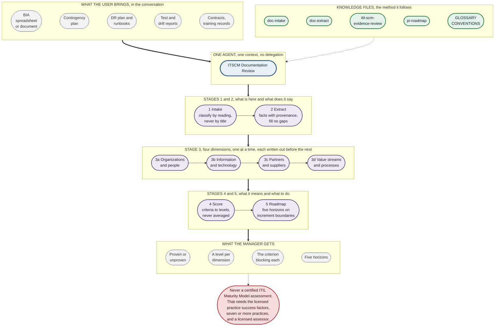
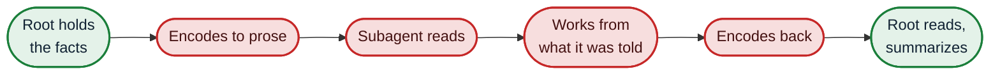

# The evaluation flow

Five stages, worked through in order inside **one agent and one context**. Nothing is delegated,
so nothing is serialized into prose and read back, so provenance survives to the stage that
needs it.

Blue is the agent, green is a knowledge file, purple is a stage it works through, grey is what
goes in and comes out.

## Where it stops rather than guesses

Five refusals, written into the instructions rather than left to judgment.

| Stage | Refuses to |
|---|---|
| Intake | Believe a title. A file called a Disaster Recovery Plan is often a contingency plan and occasionally a runbook |
| Extract | Fill a gap. A missing recovery objective is extracted as missing, never inferred from the architecture |
| Evaluate | Reward a heading. The question is whether content satisfies the criterion, not whether a section exists |
| Score | Average. A dimension sits at the highest level whose criteria are all met, and nine of ten met is the lower level |
| Every stage | Author a practice success factor. Where a question needs the licensed model, the answer is that it is not assessable against it |

## Why stage 3 runs one dimension at a time

The four dimensions are separate questions about the same documents, and the common failure is a
well documented set carrying a thin dimension upward: the same context that just found the plan
excellent is the context judging the supplier evidence.

Finishing and writing out one dimension's findings before starting the next is what prevents it.
The findings stay in one context rather than being handed anywhere, so the protection costs no
fidelity.

## The alternative, and what it costs

An earlier version of this design split the work across a root agent and eight subagents, one
per stage and one per dimension. `agents/00-root.md` through `agents/05-roadmap.md` still carry
that configuration.

**It loses information at every handoff**, and the losses are structural rather than incidental:

There is no state object, so the running result is serialized into natural language and read back
at every hop. Provenance is a structural fact, a document and a location per item, and it is
exactly the kind that does not survive repeated round trips.

A subagent cannot hold knowledge files either, so it never sees the source documents or the skill
it is applying. And the root decides what to forward without knowing what the subagent needs,
because the criteria live in the subagent's instructions, which the root never reads. That puts a
filter operated by the wrong party at the point where dropping one fact changes a verdict.

**What the split buys** is that four evaluators cannot see each other's answers, which prevents
the halo effect structurally rather than behaviorally. That is real and it is small next to the
loss above.

**When to revisit:** watch the single agent flatter its weakest dimension, then run the same
document set through both and compare that one dimension. If the split scores it lower, it has
earned its cost. If the scores match, it has not.
