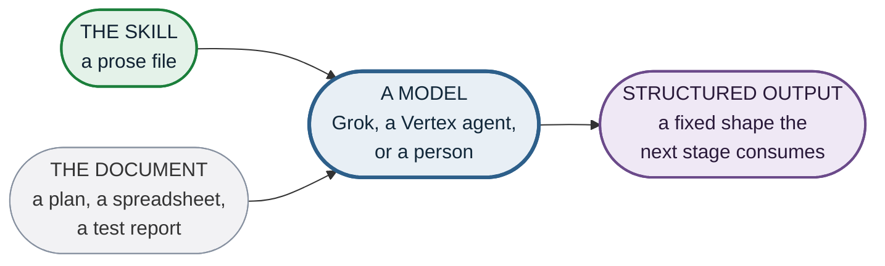
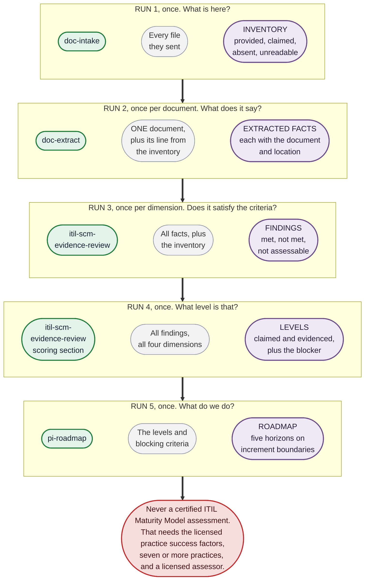

# How the skills get used

A skill here is a prose instrument. You give it to a model along with a document, and it returns
structured output. That is the whole unit of work, and it is the same unit whether the model is
Grok, a Vertex agent, or a person reading the skill and doing it by hand.

Nothing in a skill is executed. That is why the same file works in all three places, and it is
why [`../CONVENTIONS.md`](../CONVENTIONS.md) rule 3 exists.

## The five runs, and what goes into each

Five of those units, chained. Each one's output is the next one's input.

Green is the skill you paste in, grey is what you paste alongside it, purple is what comes back.

**Run 2 repeats per document and run 3 repeats per dimension.** That is not parallelism, it is
the same skill run again with different input. A spreadsheet and a Word plan are two runs of
`doc-extract`, not one run that handles both.

**Run 4 uses the same skill file as run 3**, its scoring section. They are separated because
answering criteria and assigning a level are different jobs, and a model doing both in one pass
tends to pick the level first and fit the criteria to it.

## What has to survive between runs

The output of one run is pasted into the next, so everything the later stage needs has to be in
that text. Two things get lost first.

**Provenance.** Every extracted fact carries the document and the location it came from. If a run
2 output is summarized before being pasted into run 3, the facts arrive looking identical to
guesses, and by run 4 nothing can tell them apart. Paste the output whole.

**The four states.** `provided`, `claimed but not provided`, `confirmed absent` and `unreadable`
are not decoration. Run 3 needs them to tell `NOT MET` from `NOT ASSESSABLE`, which have
different remedies: one needs work, the other needs somebody to send a file.

## Where a hosted agent fits

A Vertex agent is one way to run the chain without pasting by hand. It does not change the
instruments, and it adds one constraint worth knowing.

**A rule must be in the agent's instructions, not in a knowledge file.** Knowledge is retrieved
against a query and chunked, so a rule sitting there reaches the model only when something in the
current query resembles it. The moment an agent is about to invent a criterion is exactly the
moment nothing in its query looks like the rule forbidding it.

So the instructions field carries everything load-bearing, derived from the skills, and the
knowledge files carry detail and examples. [`agents/single-agent.md`](agents/single-agent.md) is
that configuration.

The skills stay the source of truth, and the instructions are derived from them. When a skill
changes, the instructions have to be regenerated, and nothing in the agent interface will detect
the drift.

## Where it stops rather than guesses

| Run | Refuses to |
|---|---|
| 1 Intake | Believe a title. A file called a Disaster Recovery Plan is often a contingency plan and occasionally a runbook |
| 2 Extract | Fill a gap. A missing recovery objective is extracted as missing, never inferred from the architecture |
| 3 Evaluate | Reward a heading. The question is whether content satisfies the criterion, not whether a section exists |
| 4 Score | Average. A dimension sits at the highest level whose criteria are all met, and nine of ten met is the lower level |
| Every run | Author a practice success factor. Where a question needs the licensed model, the answer is that it is not assessable against it |
