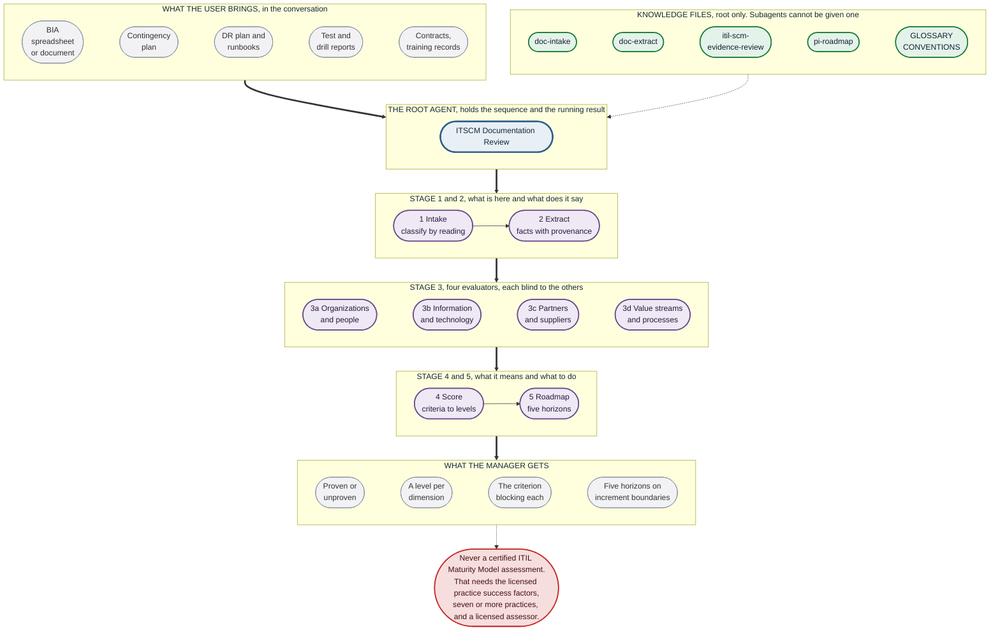

# The evaluation flow

One root agent and eight subagents. The root holds the sequence, the running result, and the
only knowledge files. Each subagent carries its own method in its instructions, because it
cannot be given a file.

Nothing here runs in parallel. The root delegates in order and carries findings between stages
itself.

## Why it splits where it does

**Four evaluators rather than one**, and not for speed, since nothing here runs in parallel.

One agent holding all four dimensions judges the thin parts in the same context that just judged
the good ones, and a strong dimension carries a weak one. Four subagents each see the facts and
their own criteria, and never see each other's answers.

There is also a practical reason. A subagent's method lives in its instructions field, so one
evaluator would have to hold four dimensions of criteria in a single field. Split four ways, each
holds only its own.

**Scoring and roadmap stay separate and stay last.** Scoring needs all four dimensions before it
can find the lowest. The roadmap is derived from what scoring found rather than from the
documents, which is what stops it becoming a list of documents to write.

## Where it stops rather than guesses

Four refusals, each written into a stage's instructions rather than left to judgment.

| Stage | Refuses to |
|---|---|
| Intake | Believe a title. A file called a Disaster Recovery Plan is often a contingency plan and occasionally a runbook |
| Extract | Fill a gap. A missing recovery objective is extracted as missing, never inferred from the architecture |
| Evaluate | Reward a heading. The question is whether content satisfies the criterion, not whether a section exists |
| Score | Average. A dimension sits at the highest level whose criteria are all met, and nine of ten met is the lower level |

A fifth refusal sits in every agent, including the root: **never author a practice success
factor.** That is where an unlicensed substitute for the ITIL Maturity Model would most
plausibly get invented, and the root is the likeliest place, because it is the agent being asked
for a maturity level.

## The thing the root will get wrong if you let it

There is no state store. The root carries the running result in the conversation, and its
instinct is to summarize each subagent's answer before moving on.

By stage 4 a summarized finding has lost its provenance, and the scorer cannot tell an extracted
fact from an inferred one. The score then reads as analysis and is fiction.

The root's instructions say to pass findings forward intact and to include prior output verbatim
rather than a paraphrase. That is the single most important line in the whole configuration.
